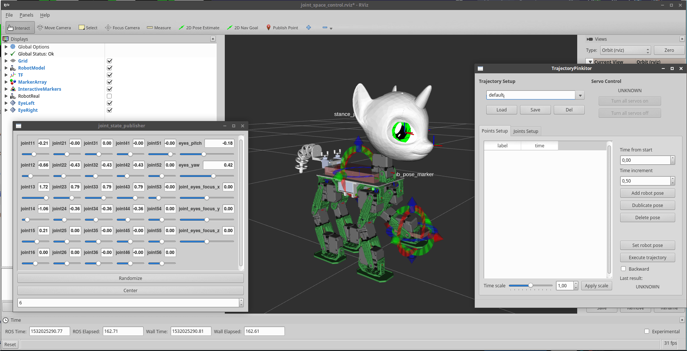

Sweetie Bot software repository 
===================================

This repository contains software framework for the [Sweetie Bot robot](http://sweetie.bot).

**Note:** We are hosting all our code on [gitlab.com](https://gitlab.com/sweetie-bot/). We also have a [github mirror](https://github.com/sweetie-bot-project/), but we do not accept pull requests there, plese use [primary source](https://gitlab.com/sweetie-bot/sweetie_bot).
Also see [`CONTRIBUTING`](CONTRIBUTING.md) page for details.



Build status               | master branch  |
---------------------------|----------------|
ros-melodic-sweetie-bot-base | [](https://gitlab.com/slavanap/ros-build/pipelines) | 
ros-melodic-sweetie-bot      | [](https://gitlab.com/sweetie-bot/sweetie_bot/commits/master) | 

## Overview

Sweetie Bot control software is based on [Robot Operating System (ROS)](http://wiki.ros.org/ROS/Introduction). Also, it uses [OROCOS](http://www.orocos.org/wiki/orocos/toolchain/getting-started) middleware to implement real-time motion control subsystem. See [`sweetie_bot_deploy`](config/sweetie_bot_deploy) and  [`rt_control`](rt_control) for more details (namespaces, nodes, configuration parameters).

Sweetie Bot software support two modes: real and virtual. 
1. In a virtual mode it runs completely on the host computer. The real robot is not needed. You can program robot behaviors in a virtual environment (3d model). 
2. In a real mode it controls the real robot. One part of software runs the host computer and another part works the on-board computer. 

Current version of Sweetie Bot control software provides following functionality:
1. Joint level control using [`joint_state_publisher`](http://wiki.ros.org/joint_state_publisher).
2. The control in Cartesian space (for the limbs and the body) using [pose markers](hmi/sweetie_bot_rviz_interactions) and [MoveIt!](https://moveit.ros.org/) integration.
3. Movements creation (See [TrjectoryEditor](hmi/sweetie_bot_joint_trajectory_editor))
4. High-level control based on [FlexBe](http://philserver.bplaced.net/fbe/) hybrid finite state machines via external repository [`sweetie_bot_flexbe_behaviors`](https://gitlab.com/sweetie-bot/sweetie_bot_flexbe_behaviors).

## Repository content

This repository contains all necessary software components to run the Sweetie Bot robots except for movements, sounds and actual behaviors which are stored in separate repositories
([`sweetie_bot_proto2_movements`](https://gitlab.com/sweetie-bot/sweetie_bot_proto2_movements), [`sweetie_bot_sounds`](https://gitlab.com/sweetie-bot/sweetie_bot_sounds) and 
[`sweetie_bot_flexbe_behaviors`](https://gitlab.com/sweetie-bot/sweetie_bot_flexbe_behaviors).

* [`config`](config) directory contains robot configuration and deployment scripts
    * `sweetie_bot_deploy` --- robot-independent OROCOS deployment scripts and ROS launch files.
	* `sweetie_bot_proto2_deploy` --- robot-specific parameters and launch files for Proto2 Sweetie Bot robot.
	* `sweetie_bot_proto2_description` --- URDF model of Proto2 (git submodule).
	* `sweetie_bot_proto2_moveit_config` --- MoveIt! configuration for Proto2.
* [`rt_control`](https://gitlab.com/sweetie-bot/sweetie_bot_rt_control) --- OROCOS-based motion control subsystem (git submodule).
* [`hardware`](hardware) --- hardware-depended components.
    * `sweetie_bot_eyes` --- eyes visualization.
* [`behavior`](behavior) --- high-level control subsystem (not implemented yet).
* [`hmi`](hmi) --- operator interface components, intended to be running on the host computer.

## Installation

The following instruction describes the installation process from binary packages. If you want to compile the whole project yourself see [`DEVELOPERS`](DEVELOPERS.md) page.

### System requirements

Check your system before install:

* OS: Ubuntu Bionic (18.04) or Debian Stretch. For Windows and Mac users we recommend virtual machine with linux installed in it. Windows users can try [WSL](https://janbernloehr.de/2017/06/10/ros-windows) but it is less supported method.
* CPU: x86-64 2 GHz dual core processor or better
* RAM: 4 GB system memory
* GPU: Almost any modern GPU with OpenGL 2.1 hardware acceleration support
* HDD: 3 GB of free hard drive space
* WAN: Internet access

#### Install apt repositories with the all necessary dependencies

There are three ways to install control software from a binary packages:

1. Automatic script (recommended)

Run the script in your terminal, it will automatically install apt repositories with the all necessary dependencies:

```
wget -qO - https://sweetie-bot.gitlab.io/sweetie_bot/install.bash | sudo bash
```

Install software packages
```
sudo apt install ros-melodic-sweetie-bot
```

2. Add apt repositories manually 

Alternatively you can install the ROS Melodic repository as listed in official ['ROS instruction'](http://wiki.ros.org/melodic/Installation/Ubuntu) and Sweetie Bot repository.

```
sudo sh -c 'echo "deb http://packages.ros.org/ros/ubuntu $(lsb_release -sc) main" > /etc/apt/sources.list.d/ros-latest.list'
sudo sh -c 'echo deb http://sweetie-bot.gitlab.io/sweetie_bot $(lsb_release -sc) main > /etc/apt/sources.list.d/sweetie-bot.list
```

Next you have to set up your keys:
```
sudo apt-key adv --keyserver hkp://ha.pool.sks-keyservers.net:80 --recv-key 421C365BD9FF1F717815A3895523BAEEB01FA116
wget -qO - https://sweetie-bot.gitlab.io/sweetie_bot/repository.key | sudo apt-key add -
```

Upgrade and install software packages
```
sudo apt update && sudo apt upgrade
sudo apt install ros-melodic-sweetie-bot
```

3. Download packages manually

Alternatively you can download deb packages manually.

First of all refer ['ROS Installation instruction'](http://wiki.ros.org/melodic/Installation/Ubuntu) manual to add official ROS repositary.

Download zip from [here](https://gitlab.com/sweetie-bot/sweetie_bot/pipelines).
Click on first green check mark ✓ and choose your OS, click "Download" at the next page.
Unpack zip file and install both .deb packages included.

```
unzip sweetie-bot-bionic-amd64.zip
sudo dpkg -i sweetie-bot-*.deb
sudo apt install -f
```

#### Setup workspace

User editable part of sweetie bot software must be installed to the home directory of current user.

Install `sweetie_bot_sounds`, `sweetie_bot_proto2_movements` and `sweetie_bot_flexbe_behaviors`: 
```
mkdir -p ~/ros/sweetie_bot/src
cd ~/ros/sweetie_bot/src
git clone https://gitlab.com/sweetie-bot/sweetie_bot_sounds.git
git clone https://gitlab.com/sweetie-bot/sweetie_bot_proto2_movements.git
git clone https://gitlab.com/sweetie-bot/sweetie_bot_flexbe_behaviors.git
```
Build workspace
```
cd ~/ros/sweetie_bot
source /opt/ros/sweetie_bot/setup.bash
catkin_make
```

**Note:** Run this to supress priority warnings `Forcing priority (20)`:

```
echo -e "@realtime   -  rtprio     99\n@realtime   -  memlock    unlimited" | sudo tee /etc/security/limits.d/99-realtime.conf
sudo groupadd realtime
sudo usermod -a -G realtime $USER
```

## Usage

Set ROS environment once in the every terminal before you start any of the following commands:
```
source ~/ros/sweetie_bot/devel/setup.bash
```

To start basic control framework:

```
roslaunch sweetie_bot_deploy joint_space_control.launch
```

Following command starts MoveIt! `move_group` and FlexBe subsystem:

```
roslaunch sweetie_bot_deploy flexbe_control.launch run_flexbe:=true
```

For more details see [`sweetie_bot_deploy` package](config/sweetie_bot_deploy).

